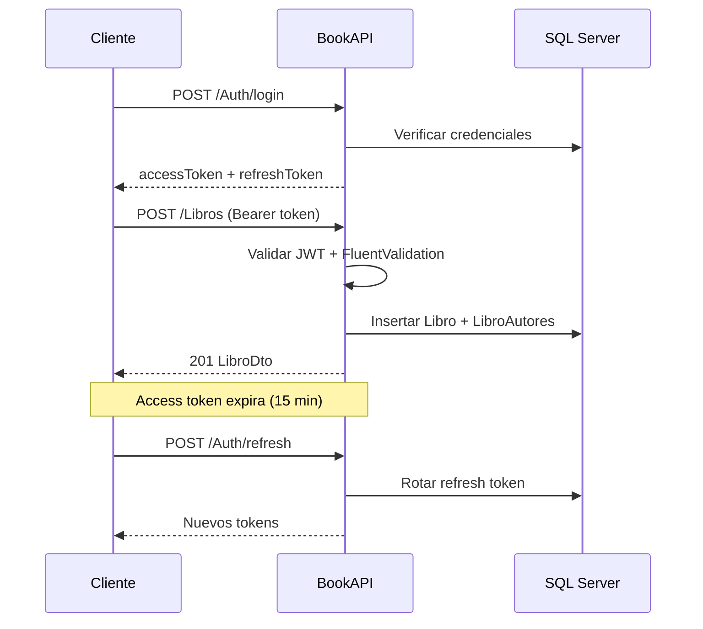

# Casos de uso

## CU-01: Registro de usuario

| Campo | Valor |
|-------|-------|
| **Actor** | Usuario anónimo |
| **Endpoint** | `POST /api/v1/Auth/register` |
| **Precondición** | Email no registrado previamente |
| **Flujo principal** | 1. El usuario envía email y contraseña → 2. El sistema valida formato y política de contraseña → 3. Crea cuenta en Identity → 4. Emite access + refresh token → 5. Retorna tokens |
| **Postcondición** | Usuario registrado y autenticado |
| **Errores** | 400 validación, 409 email duplicado |

## CU-02: Inicio de sesión

| Campo | Valor |
|-------|-------|
| **Actor** | Usuario registrado |
| **Endpoint** | `POST /api/v1/Auth/login` |
| **Flujo principal** | 1. Envía credenciales → 2. Verifica contraseña → 3. Emite nuevos tokens |
| **Errores** | 401 credenciales inválidas, 401 cuenta bloqueada (5 intentos fallidos) |

## CU-03: Renovar sesión

| Campo | Valor |
|-------|-------|
| **Actor** | Usuario con refresh token válido |
| **Endpoint** | `POST /api/v1/Auth/refresh` |
| **Flujo principal** | 1. Envía refresh token → 2. Valida hash en BD → 3. Revoca token anterior → 4. Emite nuevo par de tokens (rotación) |
| **Errores** | 401 token inválido, expirado o reutilizado (revoca todos los tokens del usuario) |

## CU-04: Crear libro con relaciones

| Campo | Valor |
|-------|-------|
| **Actor** | Usuario autenticado |
| **Endpoint** | `POST /api/v1/Libros` |
| **Precondición** | JWT válido; ISBN no duplicado; editora y autores existen si se envían |
| **Flujo principal** | 1. Envía datos del libro + `editoraId` opcional + `autorIds` opcional → 2. Valida reglas de negocio → 3. Asigna `creadoPor` desde el email del JWT → 4. Persiste libro y relaciones → 5. Retorna `LibroDto` con editora y autores |
| **Postcondición** | Libro creado con relaciones |
| **Errores** | 401 sin token, 400 validación, 404 editora/autor inexistente, 409 ISBN duplicado |

## CU-05: Consultar catálogo de libros

| Campo | Valor |
|-------|-------|
| **Actor** | Usuario autenticado |
| **Endpoint** | `GET /api/v1/Libros` |
| **Parámetros** | `page`, `pageSize`, `search` (opcional) |
| **Flujo principal** | 1. Aplica paginación (máx. 100 por página) → 2. Filtra por título, ISBN o nombre de editora si hay búsqueda → 3. Retorna `PagedResult` con metadatos |
| **Orden** | `PublicadoEn` descendente |

## CU-06: Actualizar libro y sus relaciones

| Campo | Valor |
|-------|-------|
| **Actor** | Usuario autenticado |
| **Endpoint** | `PUT /api/v1/Libros/{id}` |
| **Flujo principal** | 1. Carga libro con relaciones → 2. Valida ISBN único (excluyendo el actual) → 3. Actualiza campos y sincroniza autores (`SyncAutores`) → 4. Incrementa versión de concurrencia |
| **Errores** | 404 libro no encontrado, 409 ISBN duplicado |

## CU-07: Eliminar libro

| Campo | Valor |
|-------|-------|
| **Actor** | Usuario autenticado |
| **Endpoint** | `DELETE /api/v1/Libros/{id}` |
| **Postcondición** | Libro eliminado; registros en `LibroAutores` eliminados en cascada |

## CU-08: Gestionar autores

| Operación | Endpoint | Notas |
|-----------|----------|-------|
| Crear | `POST /api/v1/Autores` | Nombre + apellido únicos |
| Listar | `GET /api/v1/Autores` | Búsqueda por nombre/apellido |
| Obtener | `GET /api/v1/Autores/{id}` | |
| Actualizar | `PUT /api/v1/Autores/{id}` | Incluye campo `estado` |
| Eliminar | `DELETE /api/v1/Autores/{id}` | Falla si el autor está vinculado a libros (FK Restrict) |

## CU-09: Gestionar editoras

| Operación | Endpoint | Notas |
|-----------|----------|-------|
| Crear | `POST /api/v1/Editoras` | Nombre único |
| Listar | `GET /api/v1/Editoras` | Búsqueda por nombre, país, descripción |
| Obtener | `GET /api/v1/Editoras/{id}` | |
| Actualizar | `PUT /api/v1/Editoras/{id}` | Incluye campo `estado` |
| Eliminar | `DELETE /api/v1/Editoras/{id}` | Libros asociados quedan con `EditoraId = null` (SetNull) |

## Diagrama de flujo: autenticación y operación CRUD

