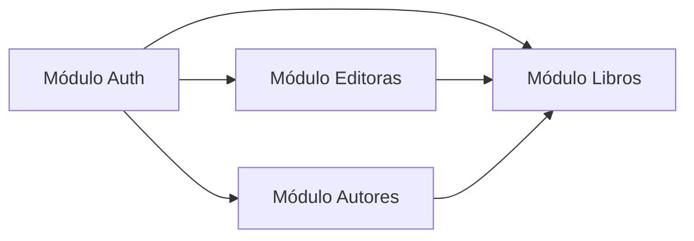

# Visión general

## Propósito

**BookAPI** es una API REST empresarial para la **gestión de catálogos bibliotecarios**. Permite administrar libros, autores y editoras, con autenticación segura y trazabilidad de auditoría en cada operación.

## Objetivos de negocio

- Centralizar el catálogo de libros con metadatos completos (ISBN, edición, idioma, portada, etc.)
- Asociar libros con sus **autores** (relación muchos a muchos) y **editoras** (relación muchos a uno)
- Garantizar integridad de datos (ISBN único, nombres de editora únicos, autores existentes)
- Proteger operaciones de escritura con autenticación JWT
- Registrar quién creó o modificó cada recurso (auditoría desde el token del usuario)

## Alcance actual

| Módulo | Estado | Descripción |
|--------|--------|-------------|
| Autenticación | ✅ Implementado | Registro, login y refresh token |
| Libros | ✅ Implementado | CRUD + paginación + búsqueda + relaciones |
| Autores | ✅ Implementado | CRUD + paginación + búsqueda |
| Editoras | ✅ Implementado | CRUD + paginación + búsqueda |
| Roles y permisos | ⏳ Pendiente | Solo autenticación (sin roles granulares) |
| Préstamos / inventario | ❌ Fuera de alcance | No implementado |

## Actores del sistema

| Actor | Descripción |
|-------|-------------|
| **Usuario anónimo** | Puede registrarse, iniciar sesión y renovar tokens |
| **Usuario autenticado** | Puede realizar CRUD sobre libros, autores y editoras |
| **Cliente API** | Aplicación frontend, mobile o integración externa que consume la API |
| **Administrador de infraestructura** | Despliega, configura secretos y aplica migraciones |

## Módulos funcionales

### Módulo de autenticación

Gestiona identidad de usuarios mediante ASP.NET Core Identity. Emite tokens JWT de corta duración y refresh tokens de larga duración con rotación automática.

### Módulo de libros

Núcleo del sistema. Un libro contiene metadatos bibliográficos y puede vincularse a una editora y a uno o más autores (con orden de autoría).

### Módulo de autores

Gestiona personas que escriben libros. Un autor puede estar asociado a múltiples libros.

### Módulo de editoras

Gestiona casas editoriales. Una editora puede publicar múltiples libros.

## Integraciones

| Sistema | Tipo | Estado |
|---------|------|--------|
| SQL Server | Base de datos relacional | Activo |
| Swagger UI | Documentación interactiva | Solo Development |
| GitHub Actions | CI/CD | Activo |
| Docker Compose | Orquestación local | Activo |

## Glosario

| Término | Definición |
|---------|------------|
| **ISBN** | International Standard Book Number; identificador único del libro |
| **Access Token** | JWT de corta duración para autorizar peticiones |
| **Refresh Token** | Token opaco de larga duración para renovar el access token |
| **Auditoría** | Campos `creadoPor`, `creadoEn`, `modificadoPor`, `modificadoEn` |
| **Paginación** | Listados con `page`, `pageSize` y `totalCount` |
