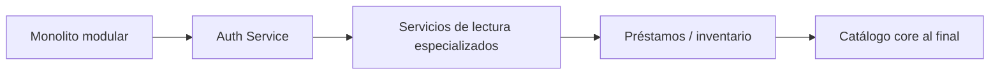

# ADR-001: Mantener monolito modular en lugar de microservicios

| Campo | Valor |
|-------|-------|
| **Estado** | Aceptado |
| **Fecha** | 2026-06-28 |
| **Decisores** | Equipo técnico BookAPI |
| **Ámbito** | Arquitectura de despliegue y evolución del sistema |

## Contexto

BookAPI es una API REST para gestión de catálogos bibliotecarios (libros, autores, editoras) con autenticación JWT. El sistema está implementado con:

- **Clean Architecture** (Api, Application, Domain, Infrastructure, Shared)
- **CQRS** con MediatR y **Vertical Slice** por feature
- **Una base de datos** SQL Server con relaciones transaccionales (libro ↔ autor ↔ editora)
- **Un despliegue** (contenedor Docker / Kestrel)
- **Equipo reducido** y alcance acotado al catálogo

Se evaluó si conviene migrar a una arquitectura de **microservicios** (Auth, Catálogo, etc.) como paso de madurez.

## Decisión

**Mantener el monolito modular** como estilo arquitectónico principal. No migrar a microservicios en la fase actual del producto.

La evolución se hará mediante:

1. **Módulos verticales** bien delimitados (`Auth`, `Libros`, `Autores`, `Editoras`, `Admin`)
2. **Contratos internos** (repositorios, servicios de aplicación) en lugar de llamadas HTTP entre módulos
3. **Tests de arquitectura** (`ArchitectureTests`) que impiden acoplamiento indebido entre capas y features
4. **Extracción incremental futura** (Strangler Fig) solo si aparecen señales de negocio u organización que lo justifiquen

## Alternativas consideradas

### A. Microservicios completos (rechazada)

| Pros | Contras |
|------|---------|
| Despliegue independiente por dominio | Partir BD relacional con FKs y transacciones ACID |
| Escalado granular | Overhead operativo (gateway, tracing, múltiples pipelines) |
| Alineación con equipos grandes | Sin equipos ni cuellos de botella que lo exijan hoy |

### B. Monolito modular (elegida)

| Pros | Contras |
|------|---------|
| Simplicidad operativa y transacciones ACID | Un solo artefacto de despliegue |
| Time-to-market alto | Escala homogénea del proceso |
| Preparado para extracción selectiva | Requiere disciplina en límites de módulos |

### C. Reescritura greenfield (rechazada)

Costo alto sin retorno; el código actual ya sigue Clean Architecture.

## Consecuencias

### Positivas

- Menor complejidad de infraestructura, observabilidad y CI/CD
- Consistencia fuerte al crear/actualizar libros con autores y editoras
- Los vertical slices y tests de arquitectura facilitan una futura extracción sin reescribir todo

### Negativas

- Todo el catálogo escala como una unidad
- Un fallo en el proceso afecta todos los módulos (mitigado con health checks y contenedor replicable)

### Riesgos y mitigaciones

| Riesgo | Mitigación |
|--------|------------|
| Acoplamiento entre features | `ArchitectureTests` + abstracciones en `Application.Abstractions` |
| Deuda en capa Application | Queries de lectura delegadas a repositorios (sin EF en Application) |
| Seguridad homogénea | Roles (`Admin`, `Editor`, `Reader`) y políticas de autorización |

## Criterios de revisión

Reevaluar esta decisión cuando se cumplan **varias** de estas condiciones:

- ≥ 2 equipos autónomos que necesiten ciclos de despliegue independientes
- Nuevo dominio con ciclo de vida propio (p. ej. préstamos, inventario, notificaciones)
- Requisitos de escala dispares medibles entre módulos
- Restricciones regulatorias que exijan aislar identidad o datos

## Orden sugerido de extracción futura

1. **Auth / Identity** — el más desacoplado
2. **Búsqueda o reporting** — si el volumen lo exige
3. **Préstamos** — nuevo bounded context
4. **Catálogo** (Libros/Autores/Editoras) — mantener unificado el mayor tiempo posible

## Referencias

- [Arquitectura](../arquitectura.md)
- [Seguridad](../seguridad.md)
- Evaluación arquitectónica interna (monolito vs microservicios, 2026-06)
