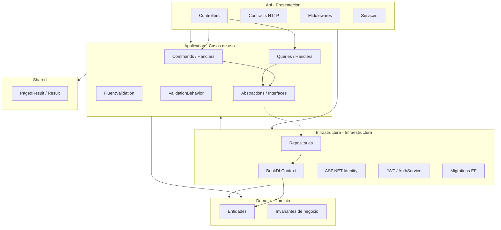

# Arquitectura

## Estilo arquitectónico

BookAPI implementa **Clean Architecture** con organización **Vertical Slice** por feature dentro de la capa Application. El patrón **CQRS** se aplica mediante **MediatR** (Commands para escritura, Queries para lectura).

## Diagrama de capas



## Proyectos de la solución

| Proyecto | Ruta | Responsabilidad |
|----------|------|-----------------|
| **Api** | `BookAPI/Api/` | Host ASP.NET Core, controladores, contratos HTTP, pipeline |
| **Application** | `BookAPI/Application/` | Casos de uso MediatR, validación, DTOs, abstracciones |
| **Domain** | `BookAPI/Domain/` | Entidades puras con lógica de negocio |
| **Infrastructure** | `BookAPI/Infrastructure/` | EF Core, repositorios, Identity, JWT, migraciones |
| **Shared** | `BookAPI/Shared/` | Tipos transversales (`PagedResult`, `Result`, `Error`) |
| **UnitTests** | `BookAPI/UnitTests/` | Pruebas unitarias de dominio y validadores |
| **IntegrationTests** | `BookAPI/IntegrationTests/` | Pruebas E2E con Testcontainers |

## Flujo de una petición HTTP

```
HTTP Request
    → Controller (mapea Contract → Command/Query)
    → MediatR
    → ValidationBehavior (FluentValidation)
    → Handler (lógica de aplicación)
    → Repository / AuthService
    → BookDbContext (EF Core)
    → SQL Server
    ← DTO
    ← HTTP Response
```

## Patrones aplicados

| Patrón | Implementación |
|--------|----------------|
| **CQRS** | MediatR: `IRequest<T>` + `IRequestHandler<T>` |
| **Repository** | `ILibroRepository`, `IAutorRepository`, etc. |
| **Unit of Work** | `IUnitOfWork.SaveChangesAsync()` |
| **Pipeline Behavior** | `ValidationBehavior` intercepta todas las requests |
| **DTO** | Records en `Application/Features/*/Dtos/` |
| **Dependency Injection** | `AddApplication()`, `AddInfrastructure()` |

## Estructura Vertical Slice

Cada feature sigue la misma organización:

```
Application/Features/Libros/
├── Commands/
│   ├── CreateLibro/
│   │   ├── CreateLibroCommand.cs
│   │   ├── CreateLibroHandler.cs
│   │   └── CreateLibroValidator.cs
│   └── UpdateLibro/ ...
├── Queries/
│   ├── ListLibros/ ...
│   └── GetLibroPorId/ ...
└── Dtos/
    ├── LibroDto.cs
    └── AutorResumenDto.cs
```

## Dependencias entre proyectos

```
Api → Application, Infrastructure
Infrastructure → Application, Domain
Application → Domain, Shared
Domain → (ninguna)
UnitTests → Application, Domain
IntegrationTests → Api
```

## Decisiones técnicas

| Decisión | Justificación |
|----------|---------------|
| MediatR sobre servicios monolíticos | Desacopla controladores de la lógica; facilita testing y extensión |
| FluentValidation en pipeline | Validación centralizada antes de ejecutar handlers |
| Identity + JWT propio | Control total sobre emisión y rotación de refresh tokens |
| EF Core con configuraciones Fluent | Mapeo explícito por entidad en `Configurations/` |
| Serilog | Logging estructurado configurable por entorno |
| Testcontainers | Pruebas de integración con SQL Server real en Docker |

## Deuda técnica conocida

| Item | Impacto | Recomendación |
|------|---------|---------------|
| Queries usan EF Core directamente en Application | Acoplamiento lectura/infra | Extraer a repositorios o proyecciones |
| Sin roles granulares | Seguridad limitada | Implementar `[Authorize(Roles)]` |
| Sin rate limiting en auth | Riesgo de fuerza bruta | `AddRateLimiter` en endpoints de login |
| Migraciones vacías duplicadas | Ruido en historial | Eliminar migraciones sin cambios |
