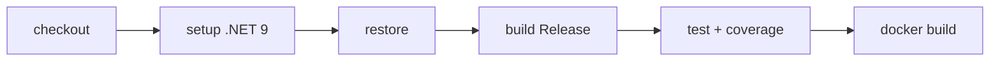

# Despliegue y DevOps

## Requisitos previos

| Herramienta | Versión |
|-------------|---------|
| .NET SDK | 9.x |
| SQL Server | 2019+ (local, Docker o cloud) |
| Docker (opcional) | Para contenedores y Testcontainers |
| dotnet-ef (opcional) | `dotnet tool install -g dotnet-ef` |

## Ejecución local

```bash
cd BookAPI
dotnet restore
dotnet build
dotnet ef database update \
  --project Infrastructure/Infrastructure.csproj \
  --startup-project Api/Api.csproj
cd Api
dotnet run
```

Acceder a Swagger: `http://localhost:5143/swagger`

## Docker

### Archivos

| Archivo | Ubicación | Descripción |
|---------|-----------|-------------|
| `Dockerfile` | Raíz del repo | Multi-stage build .NET 9 |
| `docker-compose.yml` | Raíz del repo | SQL Server + API |

### Levantar stack completo

```bash
cd /ruta/al/repositorio/BookAPI
docker compose up --build
```

| Servicio | Puerto | URL |
|----------|--------|-----|
| API | 8080 | `http://localhost:8080` |
| SQL Server | 1433 | `localhost:1433` |
| Swagger | 8080 | `http://localhost:8080/swagger` |
| Health | 8080 | `http://localhost:8080/health` |

### Variables Docker Compose

```bash
# Personalizar antes de levantar
export MSSQL_SA_PASSWORD="TuPasswordSeguro123!"
export JWT_SECRET_KEY="TuClaveJwtDeAlMenos32CaracteresSeguros!"
docker compose up --build
```

### Dockerfile (resumen)

1. **Stage build:** `dotnet/sdk:9.0` → restore + publish Release
2. **Stage runtime:** `dotnet/aspnet:9.0` → copia publish, expone 8080
3. **Healthcheck:** `curl http://localhost:8080/health`

## Publicación manual

```bash
cd BookAPI/Api
dotnet publish -c Release -o ../../publish
```

El directorio `publish/` contiene el artefacto desplegable para IIS, Kestrel + Nginx, Azure App Service, AWS, etc.

## CI/CD — GitHub Actions

**Archivo:** `.github/workflows/ci.yml`

### Triggers

- Push a `master`, `main`, `develop`
- Pull Request a esas ramas

### Jobs



| Job | Pasos |
|-----|-------|
| `build-and-test` | restore → build Release → test con XPlat Code Coverage |
| `docker-build` | build imagen `bookapi:{sha}` (depende de build-and-test) |

## Checklist de producción

- [ ] `Jwt:SecretKey` única, ≥32 caracteres, en secret manager (no en código)
- [ ] `ConnectionStrings:DefaultConnection` apunta a BD segura
- [ ] `ASPNETCORE_ENVIRONMENT=Production`
- [ ] `RequireHttpsMetadata=true`
- [ ] HTTPS habilitado en el reverse proxy
- [ ] CORS configurado con orígenes específicos del frontend
- [ ] Migraciones aplicadas: `dotnet ef database update`
- [ ] Health check `/health` configurado en el load balancer
- [ ] Logs centralizados (Serilog → sink de producción)
- [ ] Firewall de BD restringido al origen de la API

## Despliegue en la nube (guía general)

### Azure App Service

1. Crear App Service (.NET 9, Linux)
2. Crear Azure SQL Database
3. Configurar Application Settings con variables `Jwt__*`, `ConnectionStrings__*`
4. Desplegar artefacto de `dotnet publish` o imagen Docker
5. Ejecutar migraciones desde pipeline o máquina con acceso a BD

### Base de datos remota

1. Crear instancia SQL Server en el proveedor
2. Configurar reglas de firewall
3. Aplicar migraciones:
   ```bash
   ConnectionStrings__DefaultConnection="..." dotnet ef database update \
     --project Infrastructure/Infrastructure.csproj \
     --startup-project Api/Api.csproj
   ```

## Git

```bash
git init
git add .
git commit -m "Initial commit"
git remote add origin <URL>
git push -u origin main
```

**No versionar:** `bin/`, `obj/`, secretos en `appsettings.Development.json` si contienen credenciales reales.

## Monitoreo recomendado

| Métrica | Endpoint / Herramienta |
|---------|--------------------------|
| Disponibilidad | `GET /health` |
| Readiness | `GET /health/ready` |
| Logs | Serilog → consola / Application Insights / ELK |
| Errores 5xx | Middleware de excepciones + agregador de logs |
