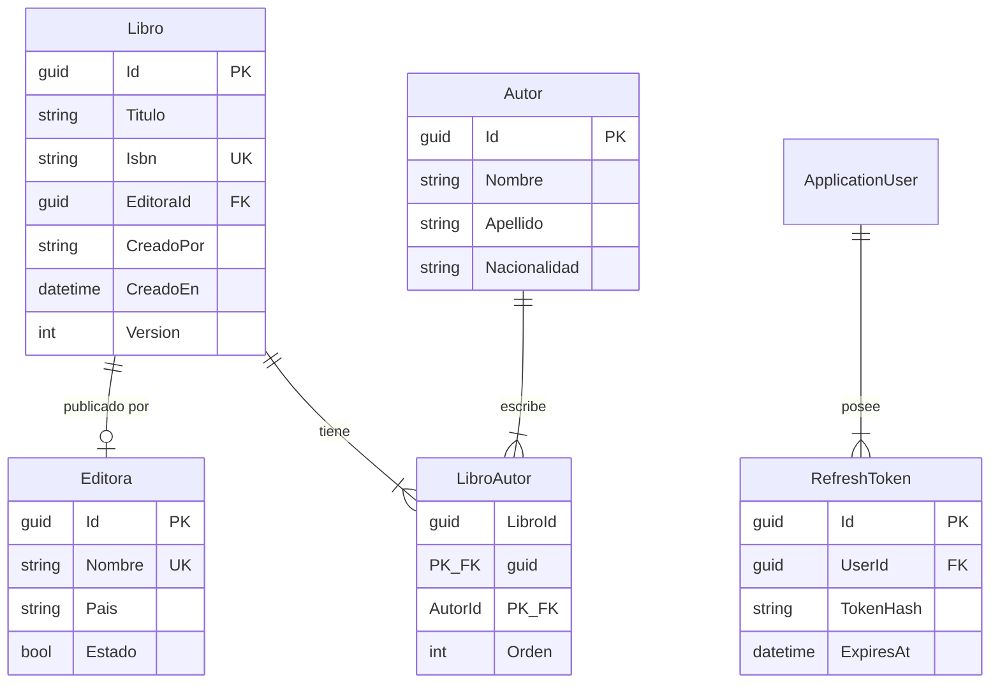

# Modelo de datos

## Diagrama entidad-relación



## Entidades de dominio

### Libro

| Campo | Tipo | Restricciones |
|-------|------|---------------|
| Id | Guid | PK, generado en dominio |
| Titulo | string | Requerido, máx. 250 |
| SubTitulo | string? | Máx. 250 |
| Isbn | string | Requerido, único, 10–17 chars |
| PublicadoEn | DateTime? | |
| Descripcion | string? | |
| Lenguaje | string? | Máx. 50 |
| Paginas | int | > 0 |
| Edicion | string? | Máx. 50 |
| CoverImageUrl | string? | Máx. 500, URI absoluta |
| EditoraId | Guid? | FK → Editoras (SetNull on delete) |
| Estado | bool | Default: true |
| CreadoPor | string | Máx. 100 |
| CreadoEn | DateTime | UTC |
| ModificadoPor | string? | Máx. 100 |
| ModificadoEn | DateTime | UTC |
| Version | int | Concurrency token |

### Autor

| Campo | Tipo | Restricciones |
|-------|------|---------------|
| Id | Guid | PK |
| Nombre | string | Requerido, máx. 50 |
| Apellido | string | Requerido, máx. 50 |
| Biografia | string? | |
| Cumpleanio | DateTime | |
| Nacionalidad | string? | Máx. 100 |
| Estado | bool | |
| Auditoría + Version | | Igual que Libro |

### Editora

| Campo | Tipo | Restricciones |
|-------|------|---------------|
| Id | Guid | PK |
| Nombre | string | Requerido, único, máx. 50 |
| Descripcion | string? | |
| Direccion | string? | |
| Pais | string? | Máx. 50 |
| Website | string? | Máx. 500, URI absoluta |
| Telefono | string? | Máx. 20 |
| Estado | bool | |
| Auditoría + Version | | |

### LibroAutor (tabla intermedia)

| Campo | Tipo | Restricciones |
|-------|------|---------------|
| LibroId | Guid | PK, FK → Libros (Cascade) |
| AutorId | Guid | PK, FK → Autores (Restrict) |
| Orden | int | ≥ 1 |

### RefreshToken

| Campo | Tipo | Descripción |
|-------|------|-------------|
| Id | Guid | PK |
| UserId | Guid | FK → AspNetUsers |
| TokenHash | string | SHA-256 del token en texto plano |
| ExpiresAt | DateTime | Fecha de expiración UTC |
| RevokedAt | DateTime? | Fecha de revocación |
| ReplacedByTokenHash | string? | Hash del token que lo reemplazó |

## Tablas de Identity (ASP.NET Core)

- `AspNetUsers`
- `AspNetRoles`
- `AspNetUserRoles`
- `AspNetUserClaims`
- `AspNetRoleClaims`
- `AspNetUserLogins`
- `AspNetUserTokens`

## Índices

| Tabla | Columna(s) | Tipo |
|-------|-----------|------|
| Libros | Isbn | Único |
| Editoras | Nombre | Único |
| LibroAutores | AutorId | No único |
| Libros | EditoraId | No único |

## Migraciones EF Core

| Timestamp | Nombre | Descripción |
|-----------|--------|-------------|
| 20260523141302 | InicioProyecto | Identity + Libros + RefreshTokens |
| 20260615233638 | Autores | Tabla Autores |
| 20260627155109 | Autores-Nacionalidad | Campo Nacionalidad |
| 20260627165022 | Libros-Migracion | Campos adicionales en Libros |
| 20260628163415 | Editoras | Tabla Editoras |
| 20260628164359 | Libros-Migracion-Editora-Mejoras | (vacía) |
| 20260628171958 | LibroRelacionesAutorEditora | FK EditoraId + tabla LibroAutores |
| 20260628172257 | Ajustes-Libros-Migracion-Editora-Mejoras | (vacía) |
| 20260628172358 | Ajustes2-Libros-Migracion-Editora-Mejoras | (vacía) |

### Comandos de migración

```bash
# Aplicar migraciones
cd BookAPI
dotnet ef database update \
  --project Infrastructure/Infrastructure.csproj \
  --startup-project Api/Api.csproj

# Crear nueva migración
dotnet ef migrations add NombreMigracion \
  --project Infrastructure/Infrastructure.csproj \
  --startup-project Api/Api.csproj

# Revertir última migración (sin aplicar a BD)
dotnet ef migrations remove \
  --project Infrastructure/Infrastructure.csproj \
  --startup-project Api/Api.csproj
```

> **Nota:** Al ejecutar `dotnet ef migrations add`, puede aparecer un log `[FTL] HostAbortedException`. Es comportamiento normal de las herramientas EF; la migración se crea correctamente si aparece `Done`.

## Configuraciones EF

Ubicación: `Infrastructure/Persistence/Configurations/`

| Archivo | Entidad |
|---------|---------|
| `LibroConfiguration.cs` | Libro |
| `LibroAutorConfiguration.cs` | LibroAutor |
| `EditoraConfiguration.cs` | Editora |

Las configuraciones de Autor y RefreshToken se aplican por convención o en el DbContext.
