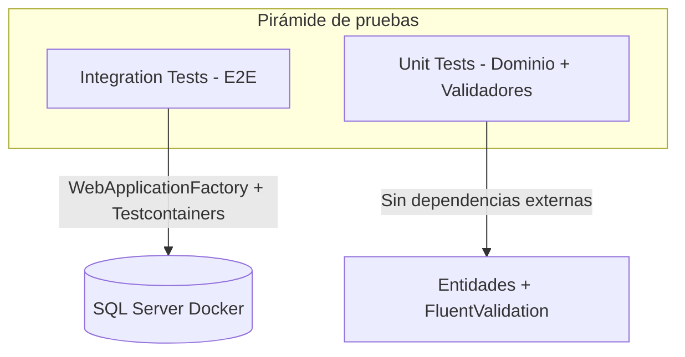

# Pruebas

## Estrategia general



| Nivel | Proyecto | Framework | Alcance |
|-------|----------|-----------|---------|
| Unitario | `UnitTests` | NUnit 4.2.2 | Dominio, validadores |
| Integración | `IntegrationTests` | NUnit + Mvc.Testing + Testcontainers | Flujo E2E completo |

## Ejecutar pruebas

```bash
cd BookAPI

# Todas las pruebas
dotnet test

# Solo unitarias
dotnet test UnitTests/UnitTests.csproj

# Solo integración (requiere Docker)
dotnet test IntegrationTests/IntegrationTests.csproj

# Con cobertura (CI)
dotnet test --collect:"XPlat Code Coverage"
```

## Pruebas unitarias

### Ubicación

```
UnitTests/
├── Domain/
│   ├── LibroTests.cs
│   └── LibroAutorRelationTests.cs
└── Validators/
    └── CreateLibroValidatorTests.cs
```

### Cobertura actual

| Archivo | Qué prueba |
|---------|-----------|
| `LibroTests` | Constructor, Update, validación de título |
| `LibroAutorRelationTests` | `SyncAutores`, orden, reemplazo, `EditoraId` |
| `CreateLibroValidatorTests` | Reglas FluentValidation (título, páginas) |

### Dependencias

- `Application` (validadores)
- `Domain` (entidades)
- NUnit, Microsoft.NET.Test.Sdk

## Pruebas de integración

### Ubicación

```
IntegrationTests/
├── BookApiFactory.cs
└── LibrosIntegrationTests.cs
```

### Infraestructura

| Componente | Descripción |
|------------|-------------|
| `Testcontainers.MsSql` | Contenedor SQL Server 2022 efímero |
| `WebApplicationFactory<Program>` | Host de la API en memoria |
| `BookApiFactory` | Configura connection string y JWT de prueba |

### Flujo del test E2E

`CreateLibro_WithEditoraAndAutores_ReturnsRelations`:

1. Inicia contenedor SQL Server
2. Aplica migraciones EF
3. Registra usuario → obtiene JWT
4. Crea editora y dos autores
5. Crea libro con `editoraId` y `autorIds`
6. Verifica respuesta con relaciones correctas

### Requisitos

- **Docker** debe estar corriendo en la máquina
- Primera ejecución puede tardar ~30s (descarga imagen SQL Server)

### Variables de test

| Variable | Uso |
|----------|-----|
| `BOOKAPI_TEST_PASSWORD` | Contraseña para registro en tests (opcional) |

Si no se define, se genera una contraseña dinámica por ejecución.

## CI/CD

GitHub Actions ejecuta `dotnet test` en cada push/PR a `master`, `main`, `develop` con cobertura XPlat.

## Convenciones para nuevas pruebas

### Unitarias

- Un archivo por clase/validator bajo prueba
- Nombres descriptivos: `Method_Scenario_ExpectedResult`
- Sin dependencias de BD ni HTTP

### Integración

- Usar `BookApiFactory` como base
- Limpiar datos o usar GUIDs únicos para evitar colisiones
- Agrupar en `[OneTimeSetUp]` el contenedor y migraciones

## Cobertura objetivo (roadmap)

| Área | Estado | Meta |
|------|--------|------|
| Dominio | ✅ Parcial | 80%+ |
| Validadores | ✅ Parcial | Todos los validators |
| Handlers | ⏳ Pendiente | Mocks de repositorios |
| Auth E2E | ⏳ Pendiente | Login, refresh, lockout |
| Controllers | ⏳ Pendiente | Via integración |

## Herramientas recomendadas

| Herramienta | Uso |
|-------------|-----|
| `dotnet test` | Ejecución |
| coverlet | Cobertura de código |
| Testcontainers | BD real en tests |
| Swagger | Pruebas manuales de API |
